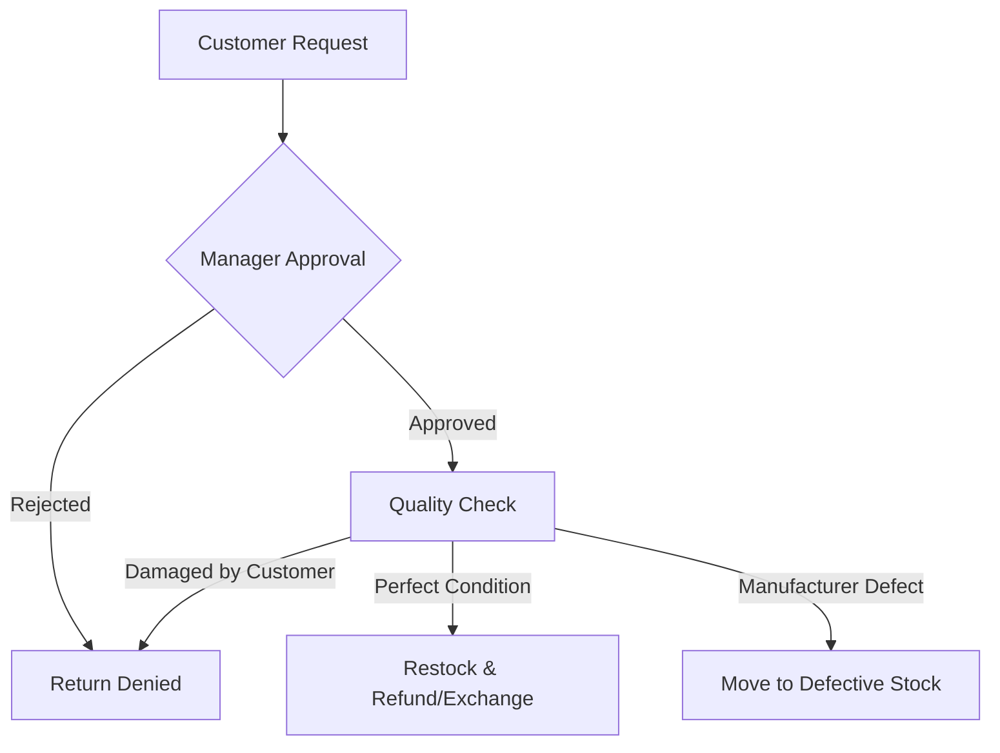
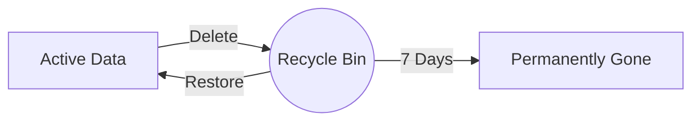

# Customer Support & Returns: A Business Owner's Guide

In modern retail, how you handle a problem is more important than how you handle a sale. Errum V2 provides professional tools to manage returns, refunds, and customer inquiries with ease.

## 1. The Return Lifecycle: Turning a Problem into a Win

When a customer wants to return an item, it follows a structured process to ensure you don't lose money and they don't lose trust.

### The Return Process Visual

### What this means for your business:
- **Verification:** You (or your manager) must approve the return first. No one can just "click a button" and drain your bank account.
- **Inventory Integrity:** If the item is perfect, the system adds it back to your stock automatically. If it's broken, it goes to a separate "Defective" list so you don't accidentally sell it to someone else.
- **Exchange Option:** Instead of giving money back, you can easily "Swap" for a different size or color.

---

## 2. Refunds: Safe and Traceable

Refunding money is a sensitive task. We make it secure.

### The Refund Journey:
1.  **Initiate:** Select the order and the amount (Partial or Full).
2.  **Verification:** The system checks: "Does this customer actually pay this much?" (Prevents over-refunding).
3.  **Execution:**
    - **Digital:** The money is sent back via SSLCommerz (for online orders).
    - **Cash/Manual:** You mark it as "Handled" and enter the bKash or Bank reference number.
4.  **Accounting:** Your profit reports are automatically adjusted to reflect the refund.

---

## 3. Customer Support (Contact Messages)

Don't let customer questions get lost in emails or Facebook DMs.

### The "Help Desk" Workflow:
- **The Submission:** A customer fills out the "Contact Us" form on your website.
- **The Ticket:** It appears in your Admin Dashboard as a "New" message.
- **The Status:**
    - **New:** Unread.
    - **In Progress:** A staff member is looking into it.
    - **Resolved:** The customer got their answer.
- **The History:** You can see every message a customer has ever sent you in one place.

---

## 4. The Recycle Bin: Your "Undo" Button

We all make mistakes. Someone might delete a product or an order by accident.

### How the Recycle Bin Works:
- **Soft Delete:** When someone clicks "Delete," the item isn't gone. It just moves to the Recycle Bin.
- **7-Day Window:** You have 7 days to see it, regret the decision, and click "Restore."
- **Permanent Purge:** After 7 days, the system cleans itself and deletes it forever to keep your database fast.

**Visual Safety Net:**

---

## 5. Handling Defective Goods & Vendor Returns

What happens to stock that is unsellable?

### The Defective Lifecycle:
- **Mark as Defective:** Remove from shelves.
- **Options:**
    - **Repair:** Fix it and put it back in stock.
    - **Clearance:** Sell "As Is" at a huge discount.
    - **Write-off:** It's garbage. Log it as a loss for tax purposes.
    - **Return to Vendor:** Ship it back to the person who sold it to you and get a credit.

---

## 6. Business Impact & Summary

With these Support Lifecycles, you get:
- **Consistency:** Every customer gets the same professional return experience.
- **Loss Prevention:** Detailed "Quality Checks" ensure you aren't refunding people for items they broke themselves.
- **Better Products:** By tracking "Defective Trends," you might realize a specific vendor is selling you low-quality goods and decide to stop buying from them.

---

## 7. Owner's Checklist
- **Weekly Review:** Look at the "Returns Report." Are people returning the same shirt over and over? Maybe the size chart on your website is wrong.
- **Support Speed:** Check your "Contact Messages" daily. Fast replies equal higher sales.
- **Defective Audit:** Don't let defective items pile up in the back room. Decide to "Clearance" or "Write-off" once a week.

*Remember: A returned item is an opportunity to show the customer how great your service is. Many customers become loyal FOR LIFE after a smooth return process!*
