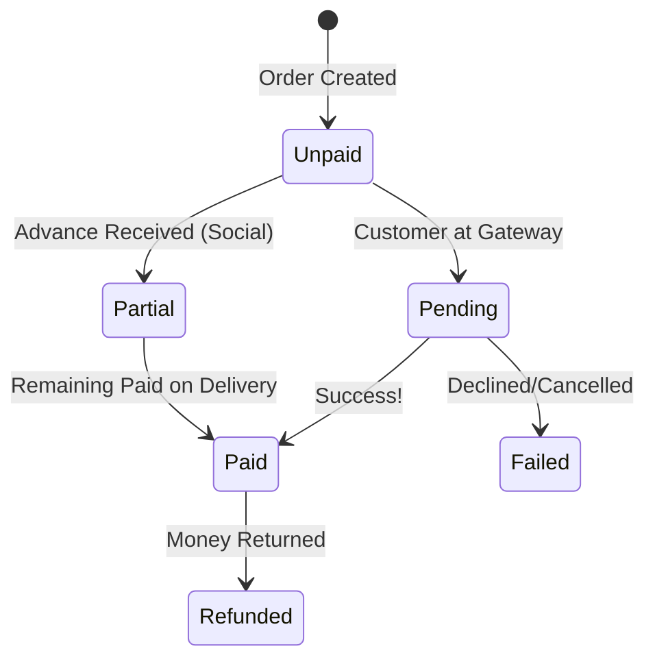
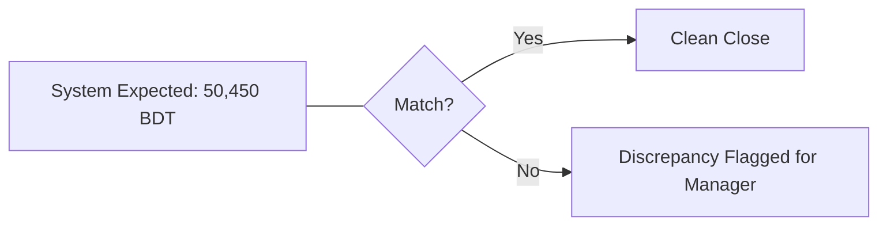

# Money, Payments & Accounting: A Business Owner's Guide

Running a business is about more than just sales—it's about collecting the money and knowing your profit. Errum V2 handles the complex "financial plumbing" so you can focus on growth.

## 1. Payment Lifecycle: Tracking Every Taka

When a customer pays, the system tracks that money through various stages until it is safely in your bank account.

### Payment Status Visual

### What this means for you:
- **Unpaid:** You see exactly who owes you money.
- **Partial:** Perfect for Social Commerce. You can require a 500 BDT advance before you ship the item.
- **Paid:** The green light. Your accounting reports are updated, and the order is ready to ship.

---

## 2. Online Payments with SSLCommerz

We use SSLCommerz, the industry standard in Bangladesh, to handle Credit Cards, bKash, Nagad, and Rocket.

### The Secure Flow (Happy Path):
1.  **Click Pay:** Customer clicks the "Pay Now" button on your site.
2.  **The Portal:** They are sent to a secure page (SSLCommerz). Your staff *never* sees their card or PIN details.
3.  **The Magic Hook:** Once they pay, the gateway sends a "Secret Message" (IPN) to your system.
4.  **Auto-Update:** Errum V2 receives the message and marks the order as "Paid" automatically. You don't have to check your phone or bank.

---

## 3. POS Payments: Cash, Cards, and Splits

In your physical store, payments need to be flexible.

### Advanced Payment Features:
- **Split Payments:** A customer can pay 2000 BDT in Cash and the remaining 3000 BDT by Card. The system tracks both separately.
- **Change Calculation:** The cashier enters "Cash Received: 1000." The system screams "Give 240 BDT back" to prevent math errors.
- **Cash Denomination Tracking:** At the end of the day, your cashier must enter how many 1000s, 500s, and 100s are in the drawer. This prevents theft and makes "Closing the Books" easy.

**Daily Reconciliation Visual:**

---

## 4. Installments: Making High-Value Items Affordable

Selling a 50,000 BDT product? Allow your customers to pay over 3 or 6 months.

### The Installment Journey:
- **The Plan:** You set up a schedule (e.g., 3 payments of 16,666 BDT).
- **Automation:** The system reminds you (or the customer) when the next payment is due.
- **Progress Tracking:** You can see a "Progress Bar" for every customer. 33% paid... 66% paid... 100% Complete!

---

## 5. Vendor Payments: Managing Your Costs

You also need to pay the people who sell *to* you.

### The Outflow Lifecycle:
1.  **Bill Received:** You enter a vendor invoice.
2.  **Allocate Advance:** You pay a deposit to start a new order.
3.  **Final Settlement:** You pay the rest once the goods arrive.
4.  **Vendor Balance:** The system keeps a running total of "What do I owe Vendor X?"

---

## 6. Accounting Reports: Your Business Dashboard

You don't need to be an accountant to understand your business health.

### Key Visual Reports:
- **Profit & Loss:** (Revenue - Costs = Profit). See this daily, weekly, or monthly.
- **Expense Tracking:** Log your rent, electricity, and staff tea bills so they are deducted from your gross profit.
- **Transaction Logs:** A searchable list of every single Taka that moved in or out of the business.

---

## 7. Business Impact & Summary

With this Financial Lifecycle, you get:
- **Zero Leakage:** Every Taka is tracked from the customer's hand to your bank.
- **No Manual Entry:** Online payments update your records instantly.
- **Audit Ready:** If you ever need to show your books to a partner or a tax official, everything is neatly organized and unchangeable.

---

## 8. Owner's Checklist
- **End-of-Day:** Ensure your staff completes the "Cash Count" before they leave.
- **Monthly Check:** Review the "Expense Report" to see where you can save money.
- **Vendor Audit:** Check the "Vendor Balance" once a month to ensure you aren't overpaying.
  
*Note: Transactions in Errum V2 are permanent. If a mistake is made, we use "Adjustment Entries" rather than deleting records, ensuring your history is always honest and accurate.*
  