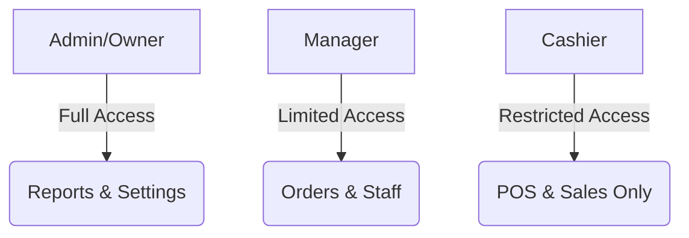
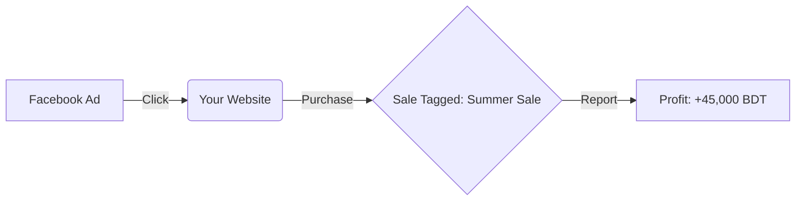

# Staff & Business Growth: A Business Owner's Guide

As your business grows, you need to manage more people and more marketing. Errum V2 provides the tools to manage your team and drive your sales to the next level.

## 1. Employee Management: Your Team, Controlled

You don't want your junior cashier seeing your total monthly profit or changing product prices.

### The Employee Journey:
- **Roles & Permissions:** You assign a role (Admin, Manager, Cashier, Warehouse). Each role only sees what they *need* to see.
- **Multi-Store Assignment:** If you have 5 stores, you can assign "Staff A" to "Store 1." They will only see orders and stock for Store 1.
- **Activity Logs:** Every important action (changing a price, deleting an order, opening the cash drawer) is logged with the staff member's name and a timestamp.

### Security Visual

---

## 2. Service Orders: Selling Your Expertise

Do you offer repairs, tailoring, or custom installations? This lifecycle is for you.

### The Service Path:
1.  **Drop-off:** Customer brings an item. You log a "Service Order."
2.  **Tracking:** Mark it as "In Progress" while your technician works on it.
3.  **Completion:** Once finished, the system notifies the customer.
4.  **Payment:** They pay when they pick up the item.

---

## 3. Marketing & Ad Campaigns: Tracking Your Success

Are your Facebook Ads actually working? Stop guessing and start tracking.

### The Campaign Lifecycle:
- **Create Campaign:** Give it a name like "Summer Sale 2026."
- **Generate Links:** The system gives you a special link to put in your Facebook ad.
- **Attribution:** When someone clicks that link and buys something, the order is "tagged" with that campaign.
- **The Report:** At the end of the month, you can see: "I spent 5000 BDT on ads, and they generated 50,000 BDT in sales."

**Campaign ROI Visual:**

---

## 4. Promotions & Discounts: Smart Selling

Run sales without the math headaches.

### Promotion Types:
- **Coupon Codes:** "SAVE10" for 10% off.
- **Automatic Rules:** "Buy 2 Get 1 Free" or "Free Shipping on orders over 5000 BDT."
- **Usage Limits:** Ensure a customer can only use a "First Order" discount one time.

---

## 5. Customer Loyalty: Building a Community

It is 5x cheaper to keep an existing customer than to find a new one.

### The Loyalty Journey:
1.  **Join:** Customer provides their phone number at the POS or website.
2.  **Earn:** Every purchase earns "Points" or moves them into a "VIP Tier."
3.  **Redeem:** On their next visit, they can pay using their points.
4.  **Engagement:** You can see who your "Top 10% Customers" are and send them a special thank-you discount.

---

## 6. Business Impact & Summary

With these Growth Lifecycles, you get:
- **Scalability:** Add 10 more stores and 50 more employees without losing control.
- **Accountability:** No more "Who deleted this?" or "Where did the money go?"
- **Data-Driven Growth:** Spend your marketing budget on what actually brings in money, and ignore what doesn't.

---

## 7. Owner's Checklist
- **Security Audit:** Once a month, check the "Activity Log" for any weird behavior.
- **Staff Performance:** See which cashier is processing the most sales—give them a bonus!
- **Campaign Review:** If an ad campaign isn't making money after 7 days, turn it off and try something new.

---

## 8. Final Word on Growth
Errum V2 isn't just a tool to *record* what happened; it's a tool to *predict* what should happen next. Use your reports, trust your data, and watch your business thrive!
