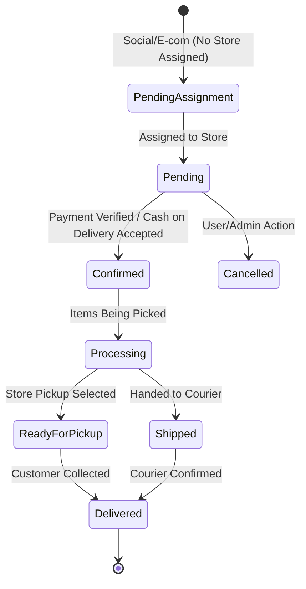
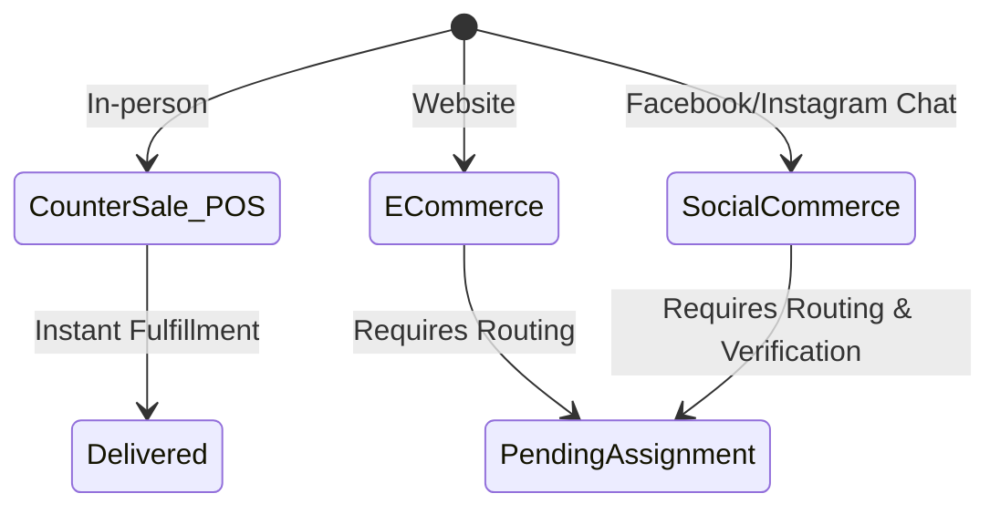
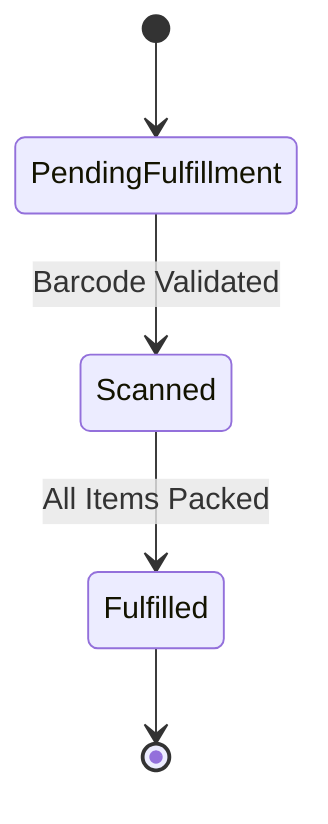
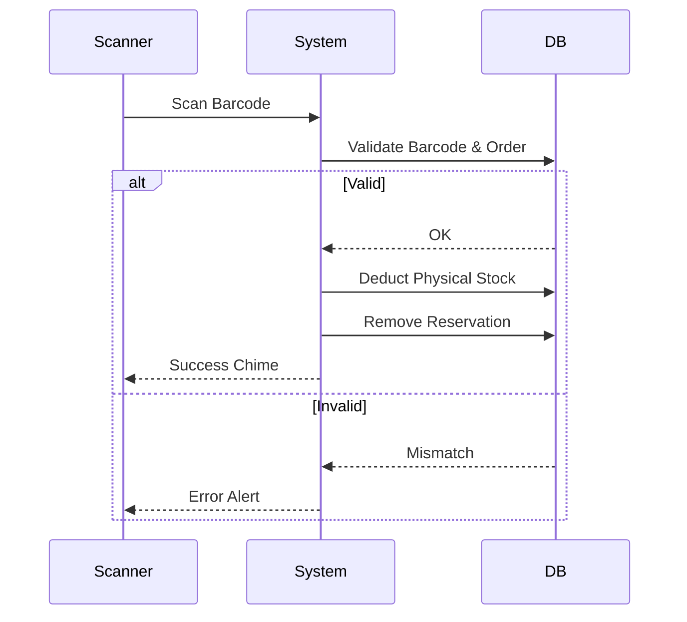
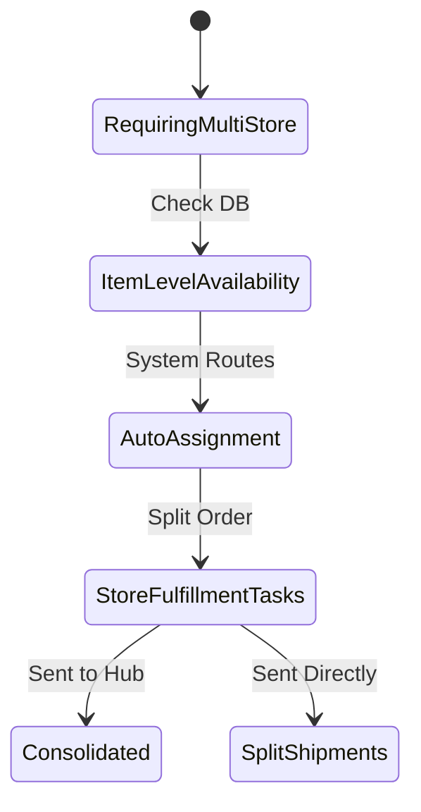
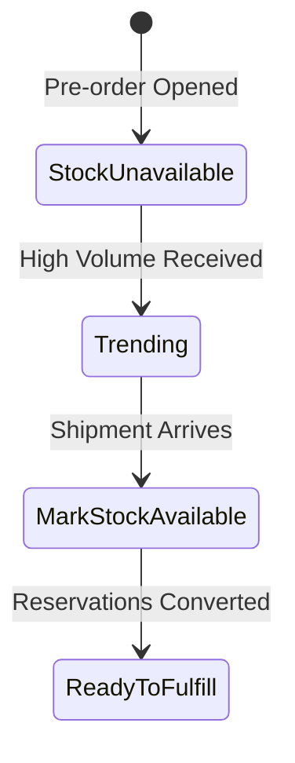

# Order Lifecycles (Social, E-commerce, POS)

This document provides a comprehensive analysis of the lifecycles governing customer orders across all sales channels in Errum V2. It covers the progression of statuses, fulfillment logic, and multi-store handling.

## Table of Contents
1. [Order Status Lifecycle](#order-status-lifecycle)
2. [Order Channel Lifecycle](#order-channel-lifecycle)
3. [Fulfillment Lifecycle](#fulfillment-lifecycle)
4. [Scanning/Fulfillment Process](#scanning-fulfillment-process)
5. [Multi-Store Fulfillment Lifecycle](#multi-store-fulfillment-lifecycle)
6. [Pre-Order Lifecycle](#pre-order-lifecycle)
7. [Order Tracking Lifecycle](#order-tracking-lifecycle)

---

## 1. Order Status Lifecycle

The core state machine that dictates the overall health and progression of an order from creation to completion.

### Flowchart

### Detailed Phases
- **Pending Assignment:** An online order has been received but the system has not yet determined which branch will fulfill it.
- **Pending:** Assigned to a branch, waiting for manual confirmation or payment validation.
- **Confirmed:** The order is valid. Inventory reservation is locked.
- **Processing:** Warehouse/Store staff are actively picking and packing the items.
- **Ready for Pickup / Shipped:** The physical items have left the active inventory area.
- **Delivered:** Final terminal state. Revenue is fully recognized.

### Examples
- **Example A:** A user buys a shirt online. It goes to *Pending Assignment*, auto-assigns to Branch 1 (*Pending*), admin confirms it (*Confirmed*), packs it (*Processing*), hands it to Pathao (*Shipped*), and the customer receives it (*Delivered*).

### Edge Cases
- **Cancellation mid-processing:** A user cancels while the item is marked *Processing*. The system must halt physical dispatch and trigger an inventory reservation rollback.

### Integrity Issues & Suggested Fixes
- **Issue:** Orders stuck in *Processing* indefinitely if the shipping courier's webhook (e.g., Pathao) fails to deliver the *Delivered* status.
- **Suggested Fix (Antigravity prompt):** "Implement a reconciliation cron job that queries the Pathao API every 12 hours for all orders in `Shipped` status older than 3 days to force-sync the final delivery status."

---

## 2. Order Channel Lifecycle

Orders originate from three distinct channels, each with slightly different automation rules.

### Flowchart

### Detailed Phases
- **Counter Sale (POS):** Immediate completion. The lifecycle starts and ends almost instantly. Physical stock is deducted synchronously.
- **E-commerce:** Driven by customer self-service. High automation, relies on payment gateways (SSLCommerz).
- **Social Commerce:** Handled by staff inputting orders on behalf of chat customers. Often involves manual price overrides, custom shipping, and partial advance payments.

### Examples
- **Example A:** An Instagram customer DMs the page. Staff creates a Social Commerce order. The system tracks it separately from E-commerce for attribution reporting.

### Edge Cases
- **Channel Blurring:** A customer starts an E-commerce order but completes it via POS (e.g., "Reserve Online, Pay In-Store").

### Integrity Issues & Suggested Fixes
- **Issue:** POS orders accidentally triggering asynchronous fulfillment jobs meant for E-commerce.
- **Suggested Fix:** Ensure all event listeners strictly check the `order_channel` attribute before dispatching notification or fulfillment jobs.

---

## 3. Fulfillment Lifecycle

The micro-lifecycle focused specifically on the warehouse/store floor operations.

### Flowchart

### Detailed Phases
- **Pending Fulfillment:** A pick-list is generated.
- **Scanned:** Each item's barcode is scanned. This is the crucial moment where reserved stock becomes deducted physical stock.
- **Fulfilled:** The box is sealed and labeled.

### Examples
- **Example A:** Order has 3 items. Staff scans item 1 and 2. Status is *Scanned (Partial)*. They scan item 3. Status becomes *Fulfilled*.

### Edge Cases
- **Wrong Item Scanned:** System must audibly/visually reject the barcode if it doesn't match the order items.

### Integrity Issues & Suggested Fixes
- **Issue:** Staff bypassing the scanner and manually marking orders as *Fulfilled* without physical verification, leading to inventory desync.
- **Suggested Fix:** Enforce a strict policy/permission in the system that disables the manual "Mark as Fulfilled" button unless a specific Admin override is provided. Force barcode scanning.

---

## 4. Scanning/Fulfillment Process

A deeper dive into the technical safety mechanisms of fulfillment.

### Flowchart

### Detailed Phases
- **Validation & Reservation:** System checks if the barcode matches the SKU and if a reservation exists.
- **Store Assignment:** Verifies the user scanning the item belongs to the store assigned to the order.
- **Scanning (Physical Deduction):** The core DB transaction.
- **Finalization Fail-Safe:** Prevents finalizing an order if scanned quantities don't match ordered quantities exactly.

### Integrity Issues & Suggested Fixes
- **Issue:** Network dropout immediately after physical deduction but before reservation removal.
- **Suggested Fix:** All four steps MUST be wrapped in a single Laravel Database Transaction (`DB::transaction(function() { ... })`). If the network drops, the transaction rolls back, preventing data corruption.

---

## 5. Multi-Store Fulfillment Lifecycle

Handling complex orders where a single store cannot fulfill all items.

### Flowchart

### Detailed Phases
- **Requiring Multi-Store:** Order exceeds inventory of any single store.
- **Item-Level Store Availability:** The system evaluates stock per item per branch.
- **Auto/Manual Assignment:** The system creates sub-orders (Store Fulfillment Tasks) for each required branch.
- **Store Fulfillment Tasks:** Branch A packs Item 1, Branch B packs Item 2.

### Examples
- **Example A:** Order needs Phone (Store A) and Case (Store B). System splits the fulfillment task. Both stores ship their parts independently (Split Shipments).

### Edge Cases
- **One store fails to fulfill:** Store A completes its task, but Store B realizes the Case is defective. The master order is now in a partial-fail state.

### Integrity Issues & Suggested Fixes
- **Issue:** Customer receives two shipping charges or tracking links and gets confused.
- **Suggested Fix:** Provide clear UI communication in the Order Tracking page, showing sub-shipments linked to a single Master Order ID.

---

## 6. Pre-Order Lifecycle

Selling items before physical stock arrives.

### Flowchart

### Detailed Phases
- **Stock Unavailable:** Product allows negative reservations (pre-orders).
- **Mark Stock Available:** When the PO is received, the system matches the new physical stock against the negative reservations first.
- **Ready to Fulfill:** Standard fulfillment resumes.

### Integrity Issues & Suggested Fixes
- **Issue:** Receiving less stock than pre-ordered.
- **Suggested Fix:** The system must implement a strict FIFO (First In, First Out) queue. The oldest pre-orders get stock assigned; the rest remain in backorder status.

---

## 7. Order Tracking Lifecycle

The customer-facing view of the order status.

### Detailed Phases
- **Pending:** Order received.
- **Confirmed:** Payment secured.
- **Shipped:** Courier tracking ID generated.
- **Out for Delivery:** Courier last-mile status.
- **Delivered:** Handed to customer.

### Edge Cases
- **Delivery Attempt Failed:** Status needs to reflect "Attempted, will retry" rather than just failing back to Shipped.

### Integrity Issues & Suggested Fixes
- **Issue:** Courier APIs have rate limits; hitting them on every customer page load will cause failures.
- **Suggested Fix:** Cache tracking status responses in Redis for 15-30 minutes, or rely entirely on webhooks to update the local database, serving the customer from the local DB.
