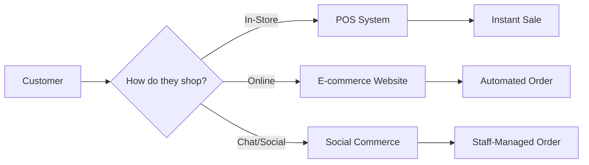
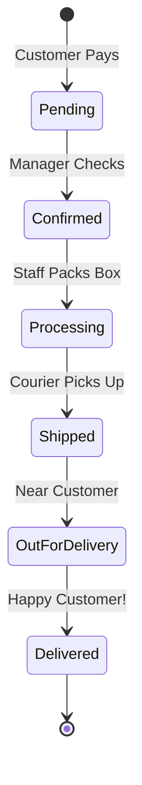
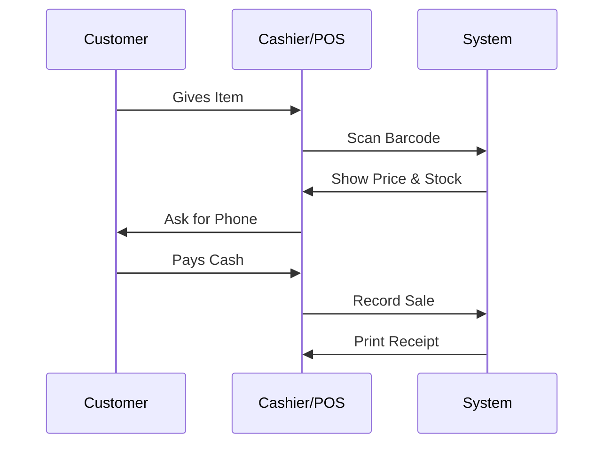

# The Sales & Ordering Process: A Business Owner's Guide

This document explains how your customers buy from you—whether they are standing in your shop, browsing your website, or chatting with you on Facebook. Errum V2 handles all three channels in one unified system.

## 1. One Business, Three Sales Channels

We treat all your sales as part of one big family, but we handle them based on how the customer likes to shop.

### The Order Channel Visual

### Channel Benefits:
- **POS (Point of Sale):** Fast. Scans the barcode, prints the receipt, and the customer walks out. The stock is updated *immediately*.
- **E-commerce:** 24/7. Customers do the work for you. Payments are handled automatically via SSLCommerz.
- **Social Commerce:** This is for your Instagram/Facebook team. They can create orders, apply custom discounts, and set up delivery while chatting with the customer.

---

## 2. The Journey of an Online Order (The "Happy Path")

When someone buys from your website, the system follows a 7-step process to ensure they get their package.

### Order Progress Flow

### What happens at each step?
1.  **Pending:** The order is in your "Inbox." The stock is now **Reserved** so no one else can buy it.
2.  **Confirmed:** You've checked that the address is real and the items are ready.
3.  **Processing:** Your warehouse team is physically putting the items in a bag.
4.  **Shipped:** You've clicked "Send to Courier." If you use Pathao, the tracking ID is automatically sent to the customer.
5.  **Delivered:** The money is in your account, and the customer is happy!

---

## 3. The "Smart" Fulfillment System

If you have multiple stores, which one should ship the order? Errum V2 decides this for you.

### Scenario: The Split Order
A customer orders a **Dress** (Available in Store A) and a **Bag** (Available only in Store B).
- **The System Action:** It splits the order into two "Tasks."
- **Store A:** Gets a notification to pack the Dress.
- **Store B:** Gets a notification to pack the Bag.
- **The Result:** The customer gets two packages (or one consolidated package at a hub), and you never lose the sale just because one store didn't have everything.

---

## 4. In-Store Selling (POS) Lifecycle

Your cashiers need speed. The POS is designed to get a customer through the line in seconds.

### The Cashier Experience:
1.  **Scan:** Use a barcode scanner to add items.
2.  **Member Check:** Ask for a phone number. If they are a "Loyalty Member," their discount applies automatically.
3.  **Pay:** Select Cash, Card, or Mobile Pay.
4.  **Print:** A professional receipt prints via the QZ Tray system.

**Visual POS Flow:**

---

## 5. Pre-Orders: Selling the Future

Sometimes you have a hot new product arriving next week. Don't wait—start selling now!

### The Pre-Order Workflow:
- **Setup:** You mark a product as "Pre-Order."
- **Customer Side:** They see a "Pre-Order" button instead of "Buy Now." They pay upfront.
- **Arrival:** When your shipment arrives and you scan it into the warehouse, the system **automatically** matches the new stock to the oldest pre-orders.
- **First-In, First-Out:** The customers who paid first get their shipments first.

---

## 6. Real-Time Tracking for Customers

Customers hate calling to ask "Where is my stuff?" We solve this with automated tracking.

### The Transparency Journey:
- **Email/SMS Notifications:** At every stage (Confirmed, Shipped, Delivered), the system can send an update.
- **Tracking Page:** The customer can log into their account on your website and see a live map or status bar of their package.

---

## 7. Business Impact & Summary

With this Ordering Lifecycle, you get:
- **Zero Overselling:** Stock is reserved the second a customer clicks "Pay."
- **Reduced Workload:** Pathao and other couriers are integrated, so you don't have to type addresses manually.
- **Happier Customers:** They know exactly where their order is, leading to fewer support calls and better reviews.

---

## 8. Pro-Tip for Success
**The 10-Minute Rule:** Try to move orders from *Pending* to *Confirmed* within 10 minutes during business hours. This speed is what turns one-time buyers into loyal fans!
