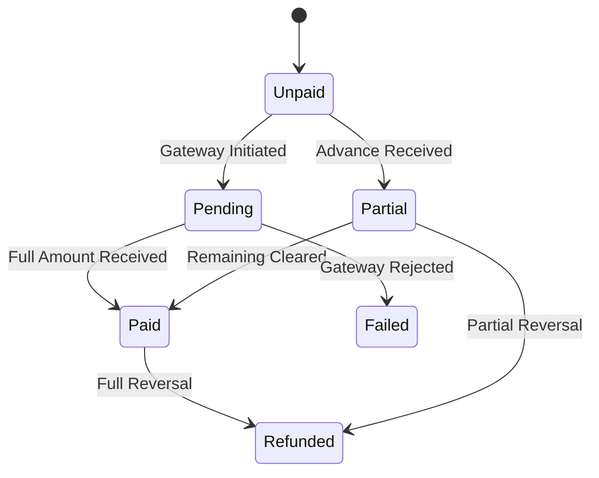
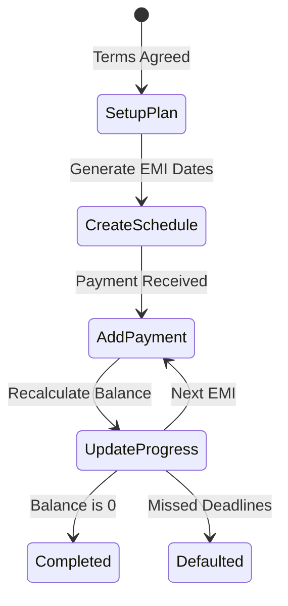
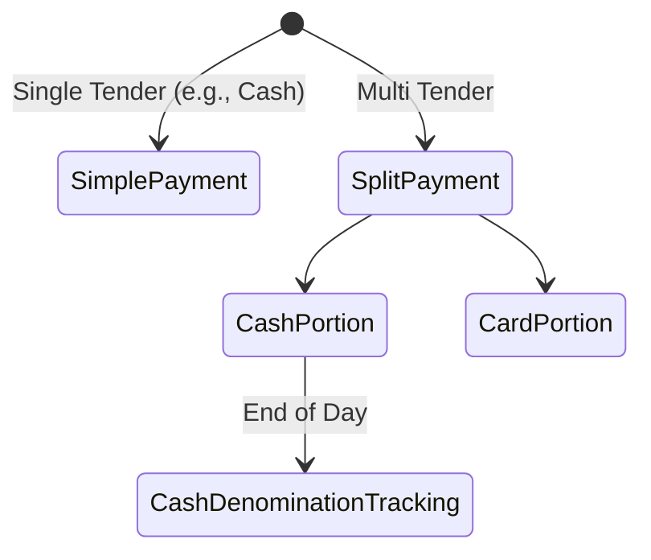
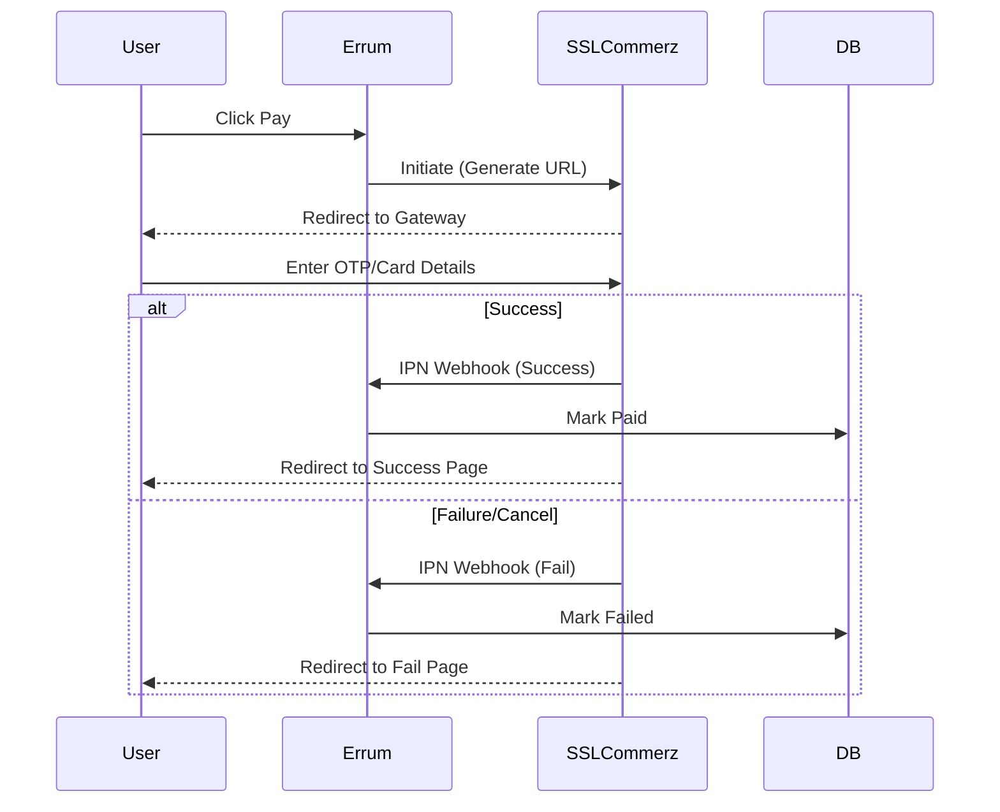
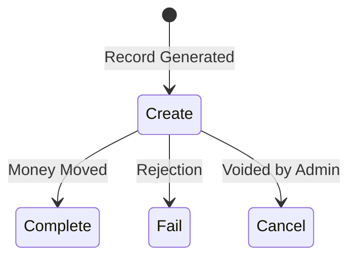

# Payment & Financial Lifecycles

This document details the financial plumbing of Errum V2. It explains how money is tracked, from simple POS payments to complex split installments, vendor advances, and SSLCommerz gateway interactions.

## Table of Contents
1. [Payment Status Lifecycle](#payment-status-lifecycle)
2. [Installment Lifecycle](#installment-lifecycle)
3. [Advanced Payment Lifecycle](#advanced-payment-lifecycle)
4. [SSLCommerz Payment Flow](#sslcommerz-payment-flow)
5. [Transaction Lifecycle](#transaction-lifecycle)

---

## 1. Payment Status Lifecycle

Tracks the overarching financial state of an order or invoice.

### Flowchart

### Detailed Phases
- **Unpaid:** Default state upon order creation (e.g., Cash on Delivery).
- **Pending:** The user has been redirected to a payment gateway, waiting for IPN (Instant Payment Notification).
- **Partial:** Common in Social Commerce. The customer paid a 500 BDT advance to confirm the order, with the rest as COD.
- **Paid:** The sum of all successful transactions meets or exceeds the order total.
- **Failed / Refunded:** Terminal failure or reversal states.

### Examples
- **Example A:** A social commerce order is created for 5000 BDT. The customer sends 1000 BDT via bKash. Status becomes *Partial*. The courier collects 4000 BDT on delivery. Status becomes *Paid*.

### Edge Cases
- **Overpayment:** A customer accidentally transfers 5500 BDT instead of 5000 BDT. The system should mark it as Paid but flag the 500 BDT overage in the customer's wallet or as an anomaly.

### Integrity Issues & Suggested Fixes
- **Issue:** Race condition where two rapid webhook calls from a payment gateway attempt to mark the order as *Paid* simultaneously, resulting in double-counting revenue.
- **Suggested Fix (Antigravity prompt):** "Add a unique constraint on `transaction_id` from the gateway, and use `firstOrCreate` or atomic locks when processing gateway webhooks to ensure idempotency."

---

## 2. Installment Lifecycle

Used for high-value items where customers pay over time.

### Flowchart

### Detailed Phases
- **Setup Plan:** Define total amount, interest (if any), and number of months.
- **Create Schedule:** System generates expected dates and amounts for each installment.
- **Add Installment Payment:** Customer pays an EMI tranche.
- **Update Progress:** System checks if the remaining balance is zero.

### Examples
- **Example A:** 12,000 BDT Laptop over 3 months. Schedule created: 4k in Jan, 4k in Feb, 4k in Mar. After Feb payment, progress is 66%, status is Active.

### Edge Cases
- **Early Payoff:** Customer wants to pay the remaining 8k in February. The system must allow consolidating the remaining scheduled tranches into one payment.

### Integrity Issues & Suggested Fixes
- **Issue:** Rounding errors. 10,000 / 3 = 3333.33. Three payments of 3333.33 leaves 0.01 unpaid, keeping the status from reaching *Completed*.
- **Suggested Fix:** Always calculate the final installment dynamically as `Total - Sum(Previous Installments)` rather than a fixed division, ensuring the balance hits exactly 0.

---

## 3. Advanced Payment Lifecycle

Covers complex POS transactions involving multiple tender types and cash drawer tracking.

### Flowchart

### Detailed Phases
- **Simple Payment:** One transaction covers the total.
- **Split Payment:** Customer pays 50% in Cash and 50% via Credit Card. Generates two linked `Transaction` records against one `Order`.
- **Cash Denomination Tracking:** At the end of the shift, the cashier must reconcile physical bills (e.g., 5x1000 notes, 10x500 notes) against the system's expected cash total.

### Examples
- **Example A:** Bill is 1500 BDT. Customer gives 1000 Cash and swipes Card for 500. Two transactions are logged. Cash drawer expected amount increases by 1000.

### Edge Cases
- **Refund on Split Payment:** If the customer returns the item, how is the refund issued? Usually, it defaults to returning the exact split (1000 Cash, 500 Card), but staff may need an override to refund entirely in Cash.

### Integrity Issues & Suggested Fixes
- **Issue:** Cashier inputs the wrong cash given (e.g., types 10000 instead of 1000), messing up the change calculation and the end-of-day drawer reports.
- **Suggested Fix:** Implement a hard warning if the "Cash Given" exceeds 500% of the total bill amount, requiring a manager's PIN to proceed.

---

## 4. SSLCommerz Payment Flow

The standard lifecycle for digital payments via the primary gateway.

### Flowchart

### Detailed Phases
- **Initiate:** System builds payload with `tran_id` and total amount, requests session URL from SSLCommerz.
- **Success/Failure:** User interaction on the gateway.
- **IPN (Instant Payment Notification):** The server-to-server webhook that is the *source of truth*. Never trust the user's browser redirect.

### Edge Cases
- **Browser Closure:** User pays successfully on SSLCommerz but closes the browser before the redirect. The IPN is the only thing that saves the order.

### Integrity Issues & Suggested Fixes
- **Issue:** IPN spoofing. Malicious actors sending fake POST requests to the IPN endpoint claiming payment success.
- **Suggested Fix:** Ensure the IPN controller cryptographically verifies the `val_id` or signature provided by SSLCommerz using the Store Password secret before processing the payment.

---

## 5. Transaction Lifecycle

The base level tracking of all money movement (Inflow/Outflow).

### Flowchart

### Detailed Phases
- **Create:** Transaction record is inserted.
- **Complete:** Final state for successful movement. Updates account ledgers.
- **Fail/Cancel:** Invalidates the transaction.

### Examples
- **Example A:** A vendor is paid 50,000 BDT. An Outflow transaction is created and Completed, reducing the main company bank account balance.

### Integrity Issues & Suggested Fixes
- **Issue:** Deleting transactions directly from the database messes up the historical ledger and audit trails.
- **Suggested Fix:** Transactions should be immutable. If a mistake is made, create a "Reversal" or "Contra" transaction to offset the amount, rather than deleting or modifying the original row.
