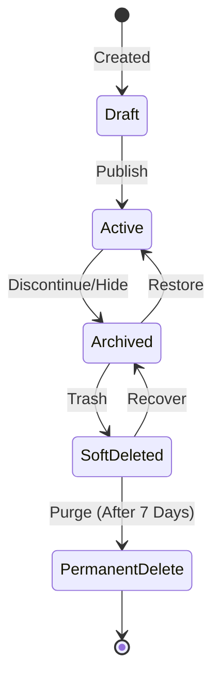
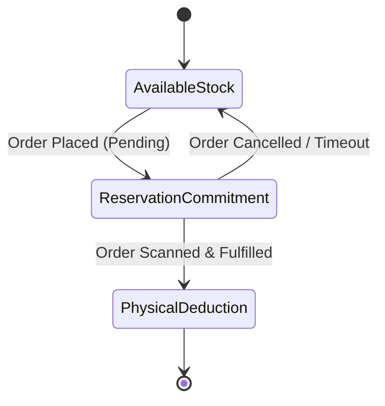
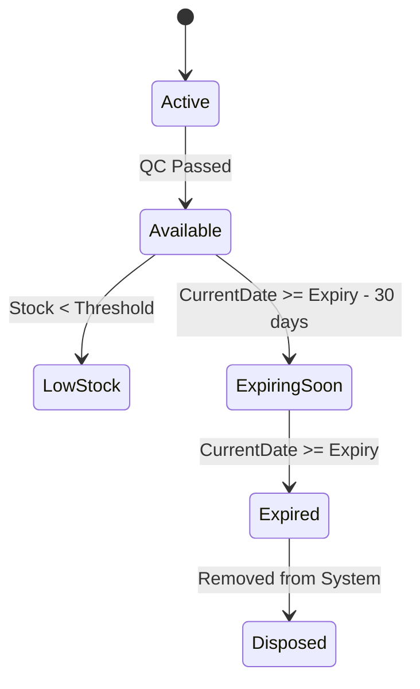
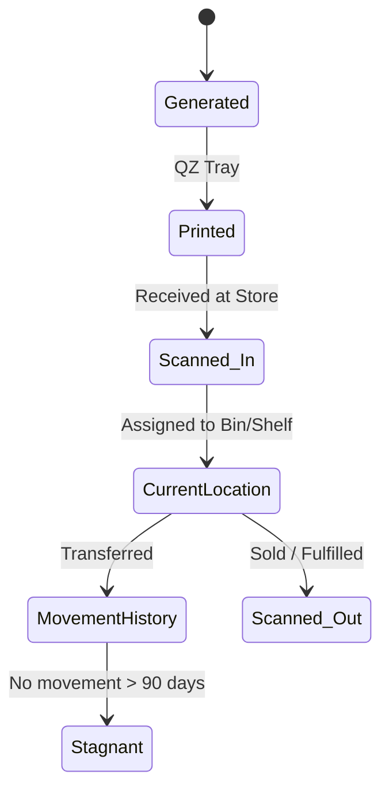
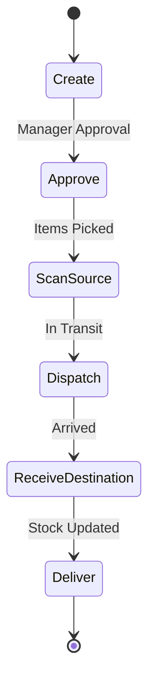
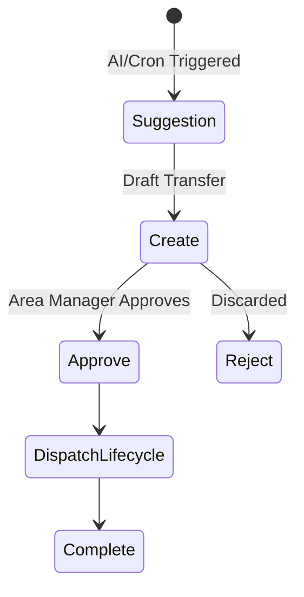
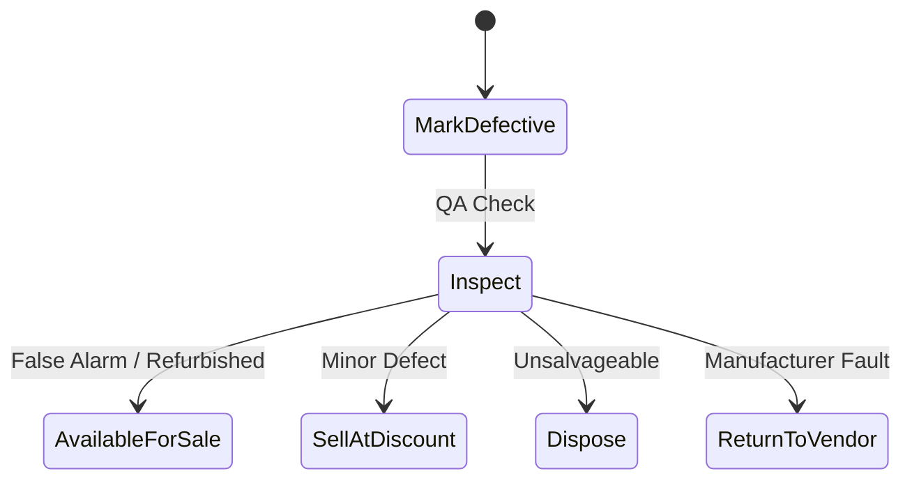
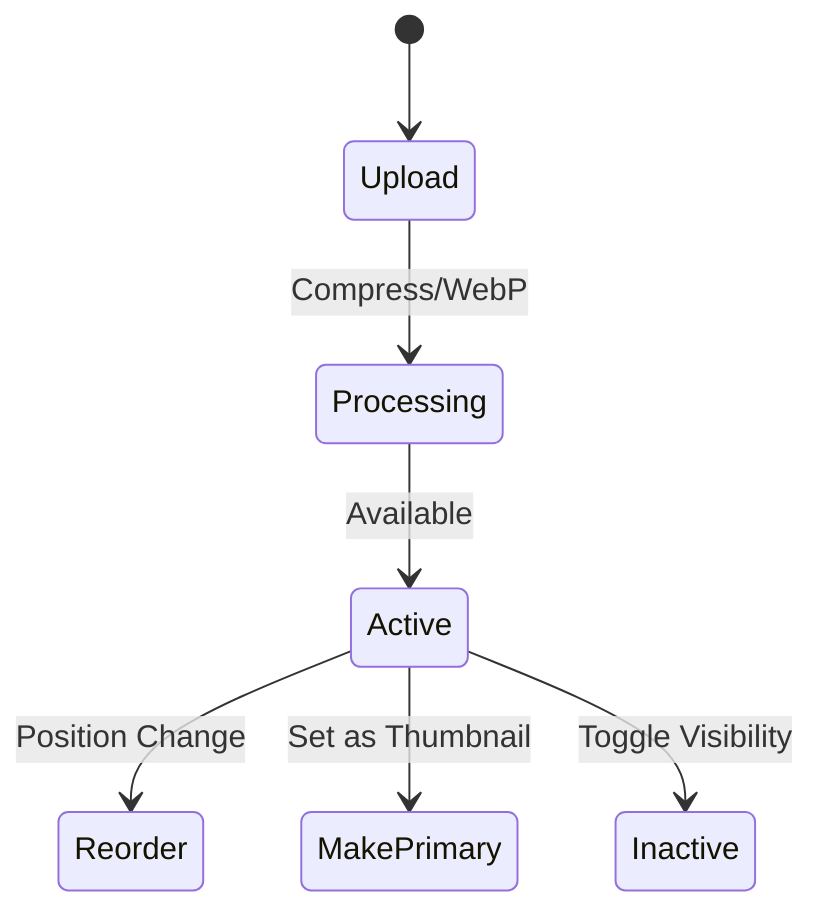

# Product & Inventory Lifecycles

This document provides an exhaustive breakdown of the various lifecycles involved in product and inventory management within the Errum V2 system. It outlines the state machines, transition rules, edge cases, and integrity checks required to maintain accurate stock and product data across a multi-store architecture.

## Table of Contents
1. [Product Lifecycle](#product-lifecycle)
2. [Inventory Reservation Lifecycle](#inventory-reservation-lifecycle)
3. [Product Batch Lifecycle](#product-batch-lifecycle)
4. [Barcode Tracking Lifecycle](#barcode-tracking-lifecycle)
5. [Product Dispatch Lifecycle (Internal Transfer)](#product-dispatch-lifecycle)
6. [Inventory Rebalancing Lifecycle](#inventory-rebalancing-lifecycle)
7. [Defective Product Lifecycle](#defective-product-lifecycle)
8. [Product Image Lifecycle](#product-image-lifecycle)

---

## 1. Product Lifecycle

The Product Lifecycle dictates the visibility and operational availability of a catalog item across the E-commerce storefront and POS.

### Flowchart

### Detailed Phases
- **Draft:** The product is being created. Basic details (title, SKU) are entered, but images or variants may be missing. Not visible to customers or POS staff.
- **Active:** Fully published. It can be searched, added to carts, and sold. Requires at least one active variant and price.
- **Archived:** Temporarily hidden. Usually for seasonal items or discontinued stock that still requires historical reporting.
- **Soft Deleted:** Moved to the recycle bin. Retained for 7 days before permanent deletion to prevent accidental data loss.
- **Permanent Delete:** Completely purged from the database. Allowed only if the product has zero historical transaction ties.

### Examples
- **Example A:** A summer t-shirt is marked as *Active* in May. By October, it is marked as *Archived*.
- **Example B:** A data entry error creates a duplicate product. The admin soft-deletes it immediately, and the cron job permanently deletes it a week later.

### Edge Cases
- **Active but out of stock:** The product is active but cannot be sold. The frontend must handle this gracefully (e.g., "Out of Stock" badge).
- **Archiving a product in a pending order:** If a product is archived while in a customer's pending cart, the checkout must block the purchase.

### Integrity Issues & Suggested Fixes
- **Issue:** Attempting to hard-delete a product that has foreign key constraints in `order_items` or `inventory_movements`.
- **Suggested Fix:** Implement a strict `Restrict` deletion rule on the database level. Add a pre-flight check in the backend that forces an `Archive` instead of `Delete` if transaction history exists.

---

## 2. Inventory Reservation Lifecycle

The most critical lifecycle in preventing overselling. It tracks the commitment of stock before it is physically removed from the master inventory.

### Flowchart

### Detailed Phases
- **Commitment (Reservation):** When an order is placed (E-commerce or Social), the requested quantity is reserved. `available_quantity` decreases, but `physical_quantity` remains unchanged.
- **Deduction (Physical Movement):** When the warehouse or store staff scans the barcode to fulfill the order, the reserved quantity is consumed, and `physical_quantity` decreases.

### Examples
- **Example A:** A store has 10 units. A customer orders 2 online. Available stock becomes 8. Reserved stock becomes 2. Physical stock remains 10. Once dispatched, reserved becomes 0, physical becomes 8.

### Edge Cases
- **Simultaneous Checkout:** Two users attempt to buy the last unit at the exact same millisecond.
- **Abandoned Carts:** Stock is reserved but never paid for, leading to artificial scarcity.

### Integrity Issues & Suggested Fixes
- **Issue:** Race conditions during reservation. If two requests read `available_quantity = 1` concurrently, both might succeed, causing overselling.
- **Suggested Fix (Antigravity prompt):** "Implement optimistic locking or a DB transaction with `SELECT ... FOR UPDATE` when reading `available_quantity` during order placement to prevent race conditions. Also, ensure a background job releases reservations for unpaid orders after 15 minutes."

---

## 3. Product Batch Lifecycle

Batches group products by manufacturing or expiry dates, crucial for FMCG (Fast-Moving Consumer Goods) or perishables.

### Flowchart

### Detailed Phases
- **Active:** Batch created upon receiving a Purchase Order.
- **Available:** Cleared for sale. POS and E-commerce allocate stock from the oldest available batch first (FIFO).
- **Low Stock:** Batch quantity falls below the store's defined threshold.
- **Expiring Soon:** System triggers an alert when the batch is within X days of its expiry date.
- **Expired:** Automatically blocked from being added to new orders or POS sales.

### Examples
- **Example A:** Batch B-101 of Face Cream is received. It expires in 6 months. After 5 months, it shifts to *Expiring Soon*, prompting a discount promotion.

### Edge Cases
- **Returning an expired product:** A customer returns a product that expired after they bought it. The system must not add it back to *Available* stock.

### Integrity Issues & Suggested Fixes
- **Issue:** Expired batches still appearing in the E-commerce available pool if the cron job fails to update their status.
- **Suggested Fix:** Instead of relying solely on cron jobs, calculate batch availability dynamically via a database view or an accessor `is_expired` based on `CURRENT_DATE`.

---

## 4. Barcode Tracking Lifecycle

Each unique item (or SKU) is tracked via barcodes for precise location management within the multi-store ecosystem.

### Flowchart

### Detailed Phases
- **Scan:** The physical action of reading the barcode. Initializes a state change.
- **Current Location:** Defines exactly which branch, warehouse, or shelf the item currently resides.
- **Movement History:** An append-only log of every location change for the barcode.
- **Stagnant:** A soft state indicating the item hasn't moved or been sold in a defined period, triggering a rebalancing suggestion.

### Examples
- **Example A:** Barcode `12345` is printed. It is scanned into Store A. Two weeks later, it is scanned out via POS. Movement history logs: Generated -> Store A -> Sold.

### Edge Cases
- **Damaged Barcode:** A barcode is unreadable, requiring manual entry which might lead to typos.
- **Duplicate Scans:** Scanning the same barcode twice during a transfer.

### Integrity Issues & Suggested Fixes
- **Issue:** Barcode stagnation logic is heavy to compute on the fly for millions of rows.
- **Suggested Fix:** Create an aggregated table `barcode_stagnation_metrics` updated nightly, indexing `last_movement_date` to quickly identify stagnant inventory.

---

## 5. Product Dispatch Lifecycle (Internal Transfer)

Governs the movement of inventory between branches or warehouses.

### Flowchart

### Detailed Phases
- **Create:** Store A requests stock from Warehouse.
- **Approve:** Warehouse manager approves the request.
- **Scan (Source):** Warehouse staff scans items into a dispatch box. Stock is deducted from the source's physical inventory.
- **Dispatch:** Status changes to In Transit. Items exist in a "limbo" virtual location.
- **Receive (Destination) & Deliver:** Store A scans items upon arrival. Stock is added to Store A's physical inventory.

### Examples
- **Example A:** Store A needs 50 units. Warehouse dispatches them. While in transit, they are not sellable. Upon receiving, Store A's stock increases by 50.

### Edge Cases
- **Loss in Transit:** Only 48 of 50 units arrive. The receiving store must log a discrepancy, moving 2 units to a "Lost/Damage" holding account.

### Integrity Issues & Suggested Fixes
- **Issue:** If the system crashes between `ScanSource` and `Dispatch`, stock might be deducted from the source but never placed in the transit state.
- **Suggested Fix:** Wrap the deduction and transit-creation logic in a rigid database transaction. Implement an automated reconciliation report to catch floating transit stock older than 14 days.

---

## 6. Inventory Rebalancing Lifecycle

The process of optimizing stock distribution across branches to prevent dead stock in one store and stockouts in another.

### Flowchart

### Detailed Phases
- **Suggestion:** Algorithm identifies Store A has stagnant stock while Store B has high demand.
- **Create & Approve:** Human oversight to validate the AI suggestion.
- **Complete:** Finalized once the physical dispatch lifecycle finishes.

### Examples
- **Example A:** Store A hasn't sold winter coats in 2 months. Store B in a colder region is out of stock. A rebalance is suggested and executed.

### Edge Cases
- **Suggestion out of date:** By the time the manager approves the rebalance (e.g., 3 days later), Store A might have sold the stock.

### Integrity Issues & Suggested Fixes
- **Issue:** Rebalancing suggestions based on stale data.
- **Suggested Fix:** Re-verify `available_quantity` dynamically at the exact moment of manager approval. If stock has changed, auto-adjust or abort the rebalancing order.

---

## 7. Defective Product Lifecycle

Handling items that are damaged, expired, or returned in poor condition.

### Flowchart

### Detailed Phases
- **Mark Defective:** Item removed from available stock and placed in a quarantine status.
- **Inspect:** Staff evaluates the condition.
- **Outcomes:** It can be restored to stock, sold at a discount (clearance), permanently disposed of (written off), or returned to the vendor for a refund.

### Examples
- **Example A:** A customer returns a scratched monitor. It is marked defective, inspected, and then moved to a clearance sale category at a 30% discount.

### Edge Cases
- **Vendor refuses return:** The lifecycle must branch from *ReturnToVendor* back to *Dispose* if the vendor rejects the claim.

### Integrity Issues & Suggested Fixes
- **Issue:** Financial tracking of disposed items. Disposing an item removes it from inventory but might not automatically create an accounting expense entry.
- **Suggested Fix:** Ensure the `Dispose` action triggers an event listener (`ProductDisposedEvent`) that automatically posts a journal entry to the "Inventory Write-off" expense account.

---

## 8. Product Image Lifecycle

Managing media assets for the catalog.

### Flowchart

### Detailed Phases
- **Upload:** Admin uploads raw images.
- **Processing:** Background task to resize and convert to WebP.
- **Reorder & Make Primary:** Determining display hierarchy.
- **Toggle Active:** Hiding an image without deleting the file.

### Examples
- **Example A:** A new product gets 5 images. One is set as primary. A seasonal image is later toggled to inactive after the season ends.

### Edge Cases
- **Primary Image Deletion:** If the primary image is deleted, the system must automatically fall back to the next active image in the order sequence.

### Integrity Issues & Suggested Fixes
- **Issue:** Orphaned files in cloud storage (S3/Local) when images are deleted from the database.
- **Suggested Fix:** When deleting an image record, dispatch a delayed background job to delete the physical file from the storage disk to prevent storage bloat.
