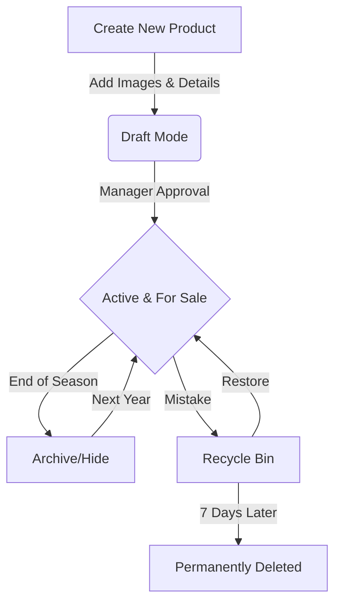
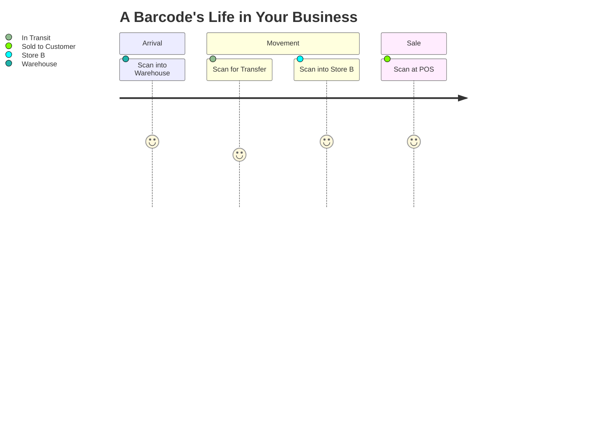
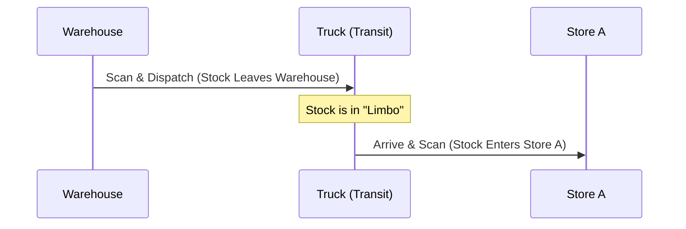

# Product & Stock Management: A Business Owner's Guide

This document explains how Errum V2 manages your physical products and inventory. For a business owner, the goal is "Right Product, Right Place, Right Time." This guide walks through the life of a product from the moment you decide to sell it until it leaves your shelf.

## 1. The Product Lifecycle: From Idea to Sale

Every product in your store follows a simple journey. We ensure that you have full control over what your customers see and what your staff can sell.

### The "Happy Path" Visual

### What this means for your business:
- **Total Control:** You can prepare new collections in "Draft" mode without customers seeing them.
- **Seasonal Flexibility:** Instead of deleting old winter coats, just "Archive" them. Their sales data stays in your reports, but they disappear from the website.
- **Safety Net:** If an employee accidentally deletes a best-seller, you have 7 days to "Restore" it from the Recycle Bin before it's gone forever.

---

## 2. Inventory: The Heart of Your Cash Flow

Inventory is money sitting on a shelf. Errum V2 tracks every single unit so you never lose a sale due to "ghost stock" or overselling.

### How Stock Moves (The Lifecycle)
1.  **Available Stock:** These are units sitting on your shelf ready for a customer.
2.  **Reserved Stock:** A customer has placed an order online. We "hold" the item for them. It’s still in your building, but it's no longer "Available" for someone else to buy.
3.  **Sold & Deducted:** Once the staff scans the item and puts it in a delivery bag, the stock is officially removed from your records.

### Why "Reservation" Matters
Imagine you have 1 unit of a luxury watch left. 
- At 2:00 PM, an online customer orders it.
- At 2:05 PM, a walk-in customer wants to buy it.
- **The Result:** The system tells the walk-in customer it's "Out of Stock" because it’s already reserved for the online buyer. This prevents the "Sorry, we sold it to someone else" phone call that ruins your reputation.

---

## 3. Product Batches & Expiry

If you sell items like cosmetics, snacks, or chemicals, you need to know which ones were bought when.

### The Batch Journey
- **Active:** New stock arrives and is given a Batch ID.
- **Selling:** The system automatically sells the *oldest* stock first (First-In, First-Out) to ensure nothing expires on your shelf.
- **Low Stock Alerts:** When a batch drops below 10 units (or whatever number you choose), you get a notification to re-order.
- **Expiry Warnings:** You’ll get a report of items expiring in the next 30 days, allowing you to run a "Flash Sale" to clear them out.

---

## 4. Barcode Tracking: Knowing Where Everything Is

Every item has a "Digital Fingerprint" (Barcode). This allows you to track an item’s movement across multiple stores.

### Visualizing the Scan Journey

### Business Benefits:
- **No Manual Entry:** Staff scan to move items. This eliminates typos and "human error."
- **Stagnant Stock Reports:** The system can tell you, "This specific box has been sitting in Store A for 90 days without moving. Move it to Store B where it's in demand."

---

## 5. Moving Stock Between Stores (Internal Transfer)

In a multi-store business, you often need to shift stock to where the customers are.

### The 5-Step Success Path:
1.  **The Request:** Store A asks for 20 units of Blue Jeans.
2.  **The Approval:** You (or a manager) click "Approve."
3.  **The Pick:** Warehouse staff scans 20 units into a box.
4.  **The Transit:** The units are marked as "In Transit." They aren't in the Warehouse anymore, but they aren't in Store A yet.
5.  **The Arrival:** Store A scans the box. Their inventory goes up instantly.

**Visual Diagram:**

---

## 6. Handling Defective Products

Not every product is perfect. Some arrive damaged or are returned by customers.

### The "Rescue" Workflow:
- **Identify:** Staff marks an item as "Defective." It is immediately removed from the "Available to Sell" list.
- **Inspect:** A manager looks at it.
- **The Outcome:**
    - **Fixable?** Put it back in stock.
    - **Slightly Scratched?** Move it to the "Clearance" section for a 30% discount.
    - **Broken?** Mark as "Dispose" (Write-off for taxes).
    - **Vendor Error?** Return it to the manufacturer for a refund.

---

## 7. Business Impact & Summary

By using these lifecycles, your business gains:
- **100% Accuracy:** You know exactly how many units are in which store at 4:00 AM on a Sunday.
- **Reduced Loss:** By tracking defective items and stagnant stock, you stop losing money on hidden shelf-rot.
- **Faster Sales:** Automated low-stock alerts mean you never run out of your best-selling items.

---

## 8. Glossary for Your Team
- **SKU:** The unique ID for a product type (e.g., "Blue-Shirt-Medium").
- **Barcode:** The unique ID for a physical unit.
- **Rebalancing:** Moving stock between stores to match demand.
- **Write-off:** Marking a product as "lost" or "broken" so it doesn't mess up your tax or profit reports.
