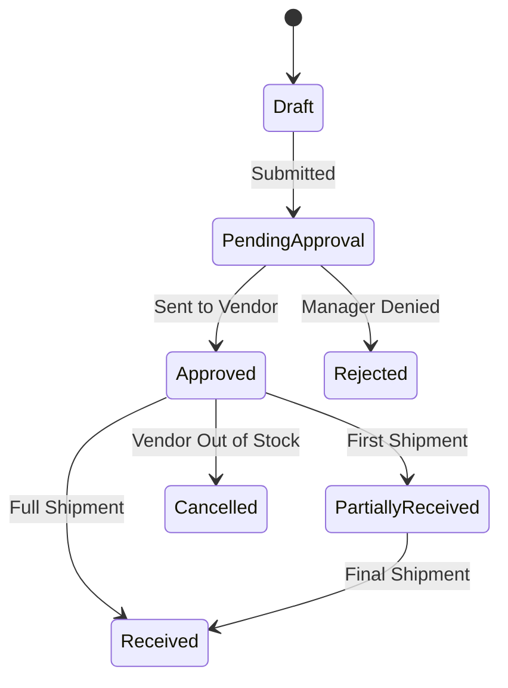
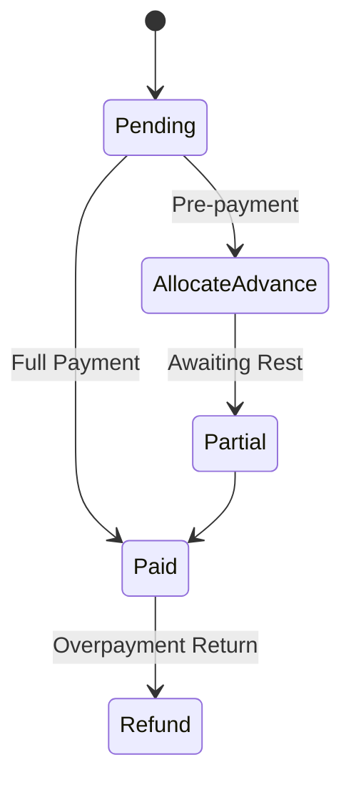
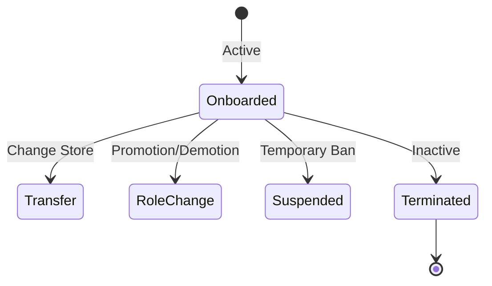
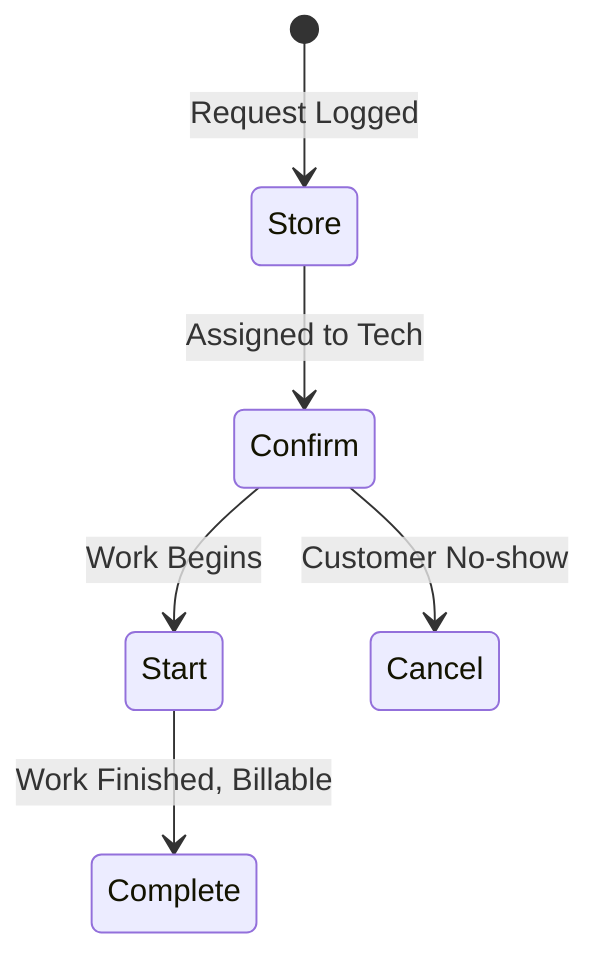
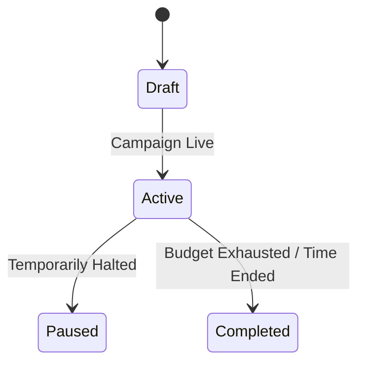
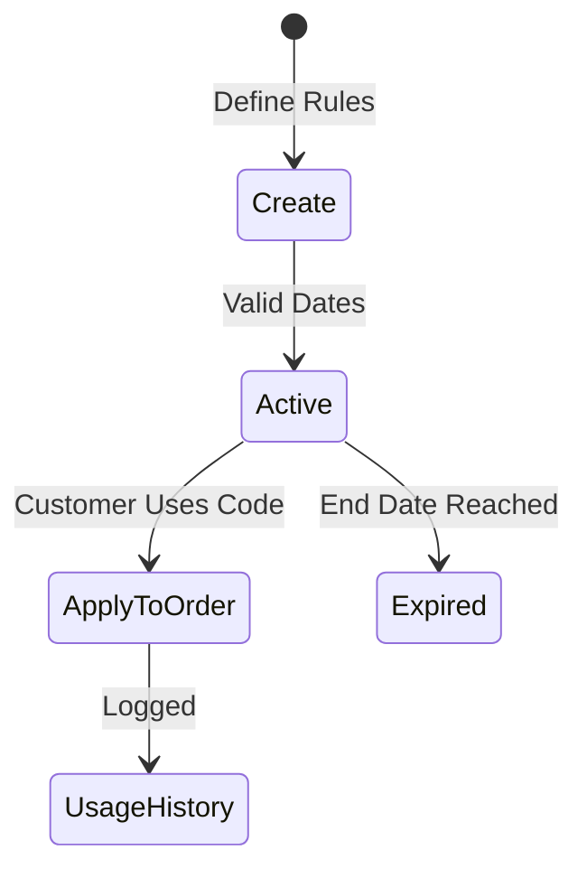

# Purchase, Vendor, Administrative & Marketing Lifecycles

This document groups the essential backend lifecycles that keep the business operating. It covers how stock is sourced (Purchasing), who it is sourced from (Vendors), how internal staff are managed (Admin), and how sales are driven (Marketing).

## Table of Contents
1. [Purchase Order (PO) Lifecycle](#purchase-order-po-lifecycle)
2. [Vendor Payment Lifecycle](#vendor-payment-lifecycle)
3. [Vendor Lifecycle](#vendor-lifecycle)
4. [Employee Lifecycle](#employee-lifecycle)
5. [Service Order Lifecycle](#service-order-lifecycle)
6. [Ad Campaign Lifecycle](#ad-campaign-lifecycle)
7. [Promotion Lifecycle](#promotion-lifecycle)

---

## 1. Purchase Order (PO) Lifecycle

The process of ordering new stock from suppliers and integrating it into the master inventory.

### Flowchart

### Detailed Phases
- **Create (Draft):** Listing the items and quantities needed.
- **Approve:** Financial sign-off. The PO is formally sent to the vendor.
- **Receive:** The physical stock arrives at the warehouse. Scanning the items in *creates new active product batches* and updates Master Inventory.
- **Cancel:** Voiding the order before it arrives.

### Examples
- **Example A:** Errum orders 1000 plain t-shirts. 500 arrive on Monday (*Partially Received*). The remaining 500 arrive on Wednesday (*Received*). Stock is updated iteratively.

### Integrity Issues & Suggested Fixes
- **Issue:** Changing the cost price of an item in a PO after some units have already been received, leading to skewed COGS (Cost of Goods Sold) accounting.
- **Suggested Fix (Antigravity prompt):** "Lock all line items in a Purchase Order from being edited once the PO transitions to `PartiallyReceived` or `Received`. Require a new PO for subsequent price changes."

---

## 2. Vendor Payment Lifecycle

Managing accounts payable. How vendors are compensated for Purchase Orders.

### Flowchart

### Detailed Phases
- **Create:** Associated with a PO or vendor invoice.
- **Allocate Advance:** Paying a vendor 30% upfront to start manufacturing.
- **Paid:** The balance is settled.
- **Refund:** Vendor failed to deliver and returns the advance.

### Edge Cases
- **Credit Notes:** A vendor owes Errum money from a previous defective batch. This credit note must be applied against a new vendor payment to reduce the cash outflow.

---

## 3. Vendor Lifecycle

Managing the relationship and status of suppliers.

### Detailed Phases
- **Active:** Vendor is currently approved to supply goods.
- **Inactive:** Vendor is blacklisted or temporarily suspended (e.g., due to poor quality).
- **Purchase & Payment History:** Continuous logging of all interactions for yearly vendor evaluation.

### Integrity Issues & Suggested Fixes
- **Issue:** Deleting a vendor record orphans all historical Purchase Orders.
- **Suggested Fix:** Vendors must only utilize the Soft Delete (Recycle Bin) lifecycle. Hard deletion should be strictly blocked by foreign key constraints.

---

## 4. Employee Lifecycle

Managing staff access, roles, and security within the Errum system.

### Flowchart

### Detailed Phases
- **Active / Inactive:** Controls ability to log in. Terminated employees are marked inactive, not deleted, to preserve activity logs.
- **Transfer:** Changing an employee's `store_id`, instantly revoking their access to Store A's POS and granting access to Store B.
- **Role Change:** Updating RBAC permissions (e.g., Cashier to Manager).
- **MFA Management:** Resetting Two-Factor Authentication if an employee loses their device.

### Integrity Issues & Suggested Fixes
- **Issue:** An employee is terminated, but their active session tokens in the E-commerce or Admin panel remain valid until expiry.
- **Suggested Fix:** Implement an event listener on `EmployeeStatusChanged`. If status becomes inactive, instantly revoke and delete all Personal Access Tokens (Sanctum/Passport) associated with the user.

---

## 5. Service Order Lifecycle

For non-physical product sales, such as repair services, tailoring, or installations.

### Flowchart

### Detailed Phases
- **Store:** Customer drops off a laptop for repair.
- **Confirm & Start:** Technician accepts the job and tracks hours.
- **Complete:** Service is finished. This triggers an invoice generation in the POS system.

---

## 6. Ad Campaign Lifecycle

Tracking the performance and attribution of marketing efforts.

### Flowchart

### Detailed Phases
- **Create & Target Products:** Defining which SKUs belong to a specific Facebook/Google campaign.
- **Active / Inactive:** Toggling the tracking links.
- **Attribution Health:** Tracking how many orders were generated by `?utm_campaign=summer_sale`.

### Integrity Issues & Suggested Fixes
- **Issue:** Customers clicking an ad, adding to cart, leaving, and returning a week later via direct traffic, losing the campaign attribution.
- **Suggested Fix:** Store the `utm_campaign` tag in an HTTP-only cookie with a 30-day expiry when the user first lands. Read this cookie during checkout to attribute the order correctly.

---

## 7. Promotion Lifecycle

Managing discount codes and automated rules.

### Flowchart

### Detailed Phases
- **Create:** Set rules (e.g., "10% off if Cart > 5000 BDT").
- **Validate Code:** System checks expiry, usage limits, and cart conditions in real-time.
- **Apply to Order:** Price is reduced.
- **Usage History:** Tracks who used it, preventing a single user from abusing a "one-time use" code.

### Edge Cases
- **Concurrent Usage:** A promo code has 1 use left. Two users apply it simultaneously.
- **Suggested Fix:** Decrement the `usage_count` within an atomic lock during the final order checkout transaction, not just when the code is applied to the cart. If the lock fails or count is 0, reject the order.
