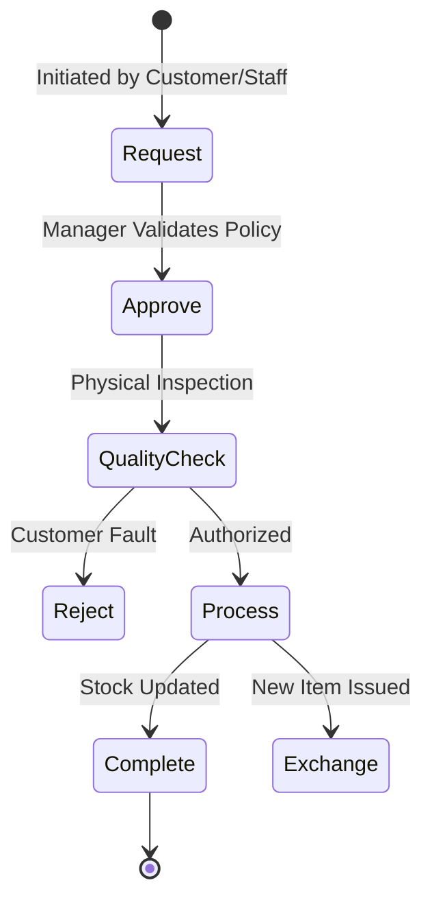
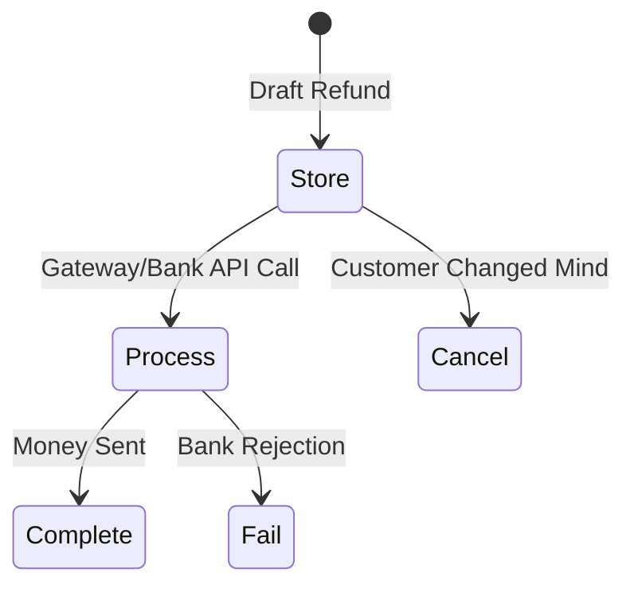
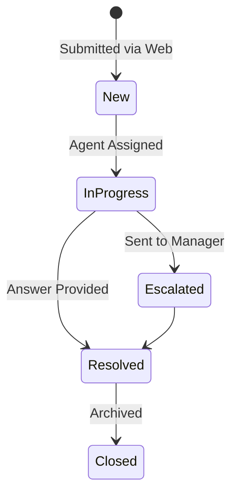
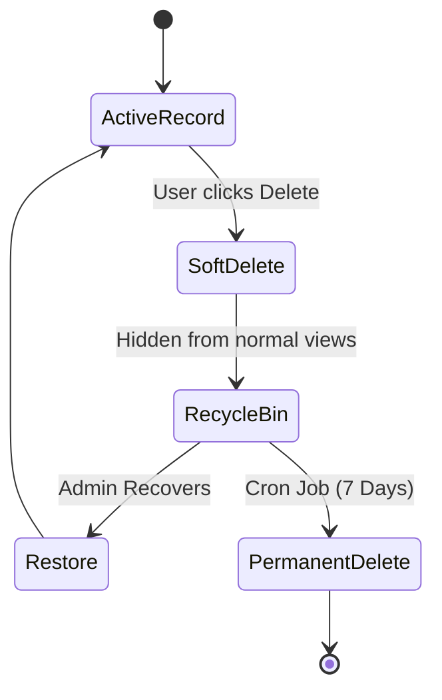

# Returns, Refunds & Support Lifecycles

This document outlines the workflows for post-purchase operations in Errum V2. These lifecycles are crucial for maintaining customer satisfaction, managing defective inventory, and ensuring accurate accounting.

## Table of Contents
1. [Product Return Lifecycle](#product-return-lifecycle)
2. [Refund Lifecycle](#refund-lifecycle)
3. [Contact Message Lifecycle](#contact-message-lifecycle)
4. [Recycle Bin Lifecycle](#recycle-bin-lifecycle)

---

## 1. Product Return Lifecycle

Manages the process when a customer brings an item back, whether for a refund, store credit, or an exchange.

### Flowchart

### Detailed Phases
- **Store / Request:** Return is initiated against an original order ID. Must be within the allowable return window (e.g., 14 days).
- **Approve:** System or manager verifies the timeline and policy eligibility.
- **Quality Check:** Crucial physical step. Is it resellable, or defective?
- **Process & Complete:** If resellable, added back to active inventory. If defective, moved to the Defective Product Lifecycle.
- **Exchange:** A parallel path where instead of a refund, a new order is spawned for the replacement item.

### Examples
- **Example A:** Customer returns a shirt because it's too small. It passes QA (unworn). It is returned to active stock. An exchange order is created for the larger size.

### Edge Cases
- **Returning a discounted item:** Customer bought an item at 50% off. The return value must strictly be the discounted price paid, not the current MSRP.
- **Returning an item from a bundle:** Returning one item from a "Buy 2 Get 1 Free" deal requires complex prorated value calculations.

### Integrity Issues & Suggested Fixes
- **Issue:** Returning an item multiple times. A malicious user might try to return an item online, get a refund, and then bring the physical receipt to a store to return it again.
- **Suggested Fix (Antigravity prompt):** "Ensure the `order_items` table tracks `returned_quantity`. Add validation in the return controller: `if (requested_qty + returned_qty > ordered_qty) throw Exception`."

---

## 2. Refund Lifecycle

The financial counter-part to the physical return lifecycle.

### Flowchart

### Detailed Phases
- **Store:** The intent to refund is recorded. The amount is locked.
- **Process:** Action taken to move the money. Could be an API call to SSLCommerz, or a manual request to the finance team to issue a bKash transfer.
- **Complete:** Confirmation that the customer received the funds.
- **Fail / Cancel:** The transaction didn't go through, or the customer opted for store credit instead.

### Examples
- **Example A:** A 2000 BDT refund is approved. Finance issues a bKash send money. They mark the refund as *Complete* and enter the bKash TrxID for auditing.

### Edge Cases
- **Refund to a closed card:** The gateway attempts a refund, but the customer's credit card was cancelled. The refund fails, requiring an alternative payout method.

### Integrity Issues & Suggested Fixes
- **Issue:** Issuing a refund greater than the total order value.
- **Suggested Fix:** Implement an aggregate check across all historical refunds for a specific order. The sum of all `Refund` amounts must never exceed the `Order->grand_total`.

---

## 3. Contact Message Lifecycle

Manages inquiries, complaints, and general support tickets submitted via the E-commerce frontend.

### Flowchart

### Detailed Phases
- **Store (New):** Customer submits the contact form. Stored in the database.
- **Update Status:** As support agents interact with the message, it moves through active states.
- **Resolved/Closed:** The issue is dealt with.

### Examples
- **Example A:** User asks "Where is my order?" It enters as *New*. Support checks Pathao, replies with tracking link, marks as *Resolved*.

### Edge Cases
- **Spam Submissions:** Bots filling out the contact form thousands of times.

### Integrity Issues & Suggested Fixes
- **Issue:** Database bloat and slow support response times due to spam.
- **Suggested Fix:** Implement Google reCAPTCHA v3 on the frontend contact form and rate-limit submissions by IP address on the backend controller.

---

## 4. Recycle Bin Lifecycle

A safety net across the entire system. Instead of hard-deleting records (Orders, Products, Customers), they enter this lifecycle to prevent catastrophic accidental data loss.

### Flowchart

### Detailed Phases
- **Soft Delete:** A `deleted_at` timestamp is added to the record. Laravel automatically excludes it from normal queries.
- **7-Day Recovery:** The record sits in a special "Recycle Bin" UI for administrators.
- **Restore:** The `deleted_at` timestamp is set to null. Full recovery.
- **Permanent Delete:** A nightly scheduled task `php artisan model:prune` permanently deletes records where `deleted_at` is older than 7 days.

### Examples
- **Example A:** An admin accidentally deletes a major product category. Instead of restoring from an SQL backup, they go to the Recycle Bin and click "Restore".

### Edge Cases
- **Cascading Soft Deletes:** Deleting a Category should logically soft-delete all child sub-categories, or orphan them. Restoring the parent must be handled carefully.

### Integrity Issues & Suggested Fixes
- **Issue:** A soft-deleted product's SKU is still technically in the database, preventing a new product from being created with the same SKU due to unique constraints.
- **Suggested Fix:** Modify the unique constraint migration to be unique across `(sku, deleted_at)`. This allows a new active product to share a SKU with a soft-deleted one.
