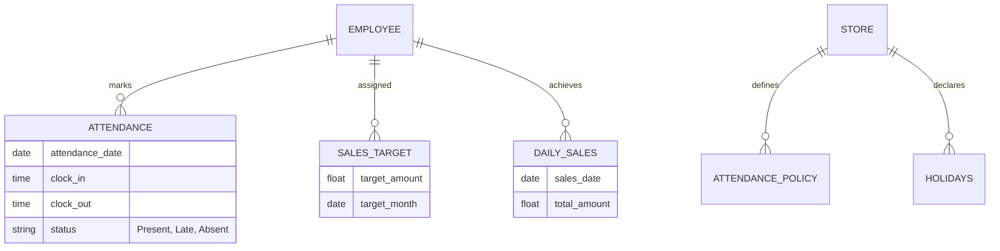

# HRM and Sales Target Integration - Technical Documentation (6 Apr 2026)

## Overview
This document details the architecture, data flow, and implementation of the **Human Resource Management (HRM)** and **Sales Target Tracking** systems within Errum V2. These modules are designed to automate attendance management, overtime calculation, and performance-based sales tracking for store employees.

---

## 1. System Architecture

### 1.1 Core Components
- **Attendance System**: Manages store policies (late entry, early exit), holidays, and daily check-ins.
- **Sales Target Engine**: Aggregates real-time sales data from orders to track employee performance against monthly goals.
- **Employee Panel**: A self-service interface for employees to view their personal performance and attendance records.

### 1.2 Data Flow (Sales Aggregation)
The system uses an **Observer Pattern** to ensure real-time data consistency.
1. An order is updated to `Delivered` or `Completed`.
2. `OrderObserver` triggers the `SalesTargetAggregationService`.
3. The service identifies the attributed employee and updates `employee_daily_sales`.
4. Monthly achievements are recalculated automatically.

---

## 2. Database Schema

---

## 3. Key Business Logic

### 3.1 Attendance Policy Execution
Attendance is evaluated against the `store_attendance_policies` table:
- **Late Entry Grace Period**: Defined in minutes (e.g., 15 mins).
- **Automated Fine Trigger**: (Planned) Integration with `employee_reward_fines` for persistent late entries.

### 3.2 Overtime Calculation
Overtime is tracked via `EmployeeOvertime` model. It records hours worked beyond the standard shift, with manual approval required by branch managers or admins.

### 3.3 Sales Attribution
Sales are attributed to employees during the POS checkout process. The `store_id` is automatically injected into all sales records to ensure branch-level data isolation.

---

## 4. API & Integration

### 4.1 Routing Structure
All HRM endpoints are prefixed with `/api/hrm/`:
- `POST /attendance/mark`: Register daily attendance.
- `GET /sales-targets/report`: Monthly performance overview.
- `GET /my/performance`: Employee-specific dashboard data.

### 4.2 Security & Access Control
- **Role-Based Access**: Only `Admin`, `Super Admin`, and `Online Moderator` can modify policies or set targets.
- **Store Scoping**: Managers are restricted to their assigned `store_id` via `assertStoreAccess` in controllers.

---

## 5. Verification Plan

| Feature | Method | Expected Result |
| :--- | :--- | :--- |
| Attendance Marking | Manual API Test | Entry created with `is_late` flag if after policy time. |
| Sales Sync | Order Completion | `employee_daily_sales` increments immediately upon order delivery. |
| RBAC | Unauthorized Account | 403 Forbidden when salesman tries to set sales targets. |

---
*End of Documentation*
